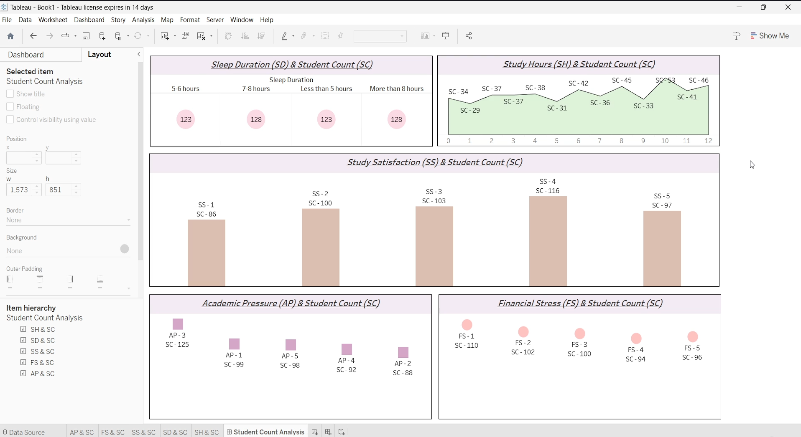

# Student Depression Analysis Dashboard  

## Problem Statement  
Mental health challenges among students are a growing concern globally. Academic pressure, lifestyle habits, and financial stress significantly contribute to depression and overall student well-being.  
This project builds an end-to-end analytics pipeline using SQL Server for data preparation and Tableau for visualization, resulting in an interactive dashboard that highlights key factors influencing student depression.  

## Objectives  
- Import and manage the **Student Depression Dataset** in SQL Server.  
- Profile, clean, and transform the dataset (standardize gender, age groups, categorical fields).  
- Create **derived attributes** (e.g., Age Groups) for better segmentation.  
- Develop multiple Tableau visualizations analyzing lifestyle and academic stress factors.  
- Combine visuals into an interactive **Student Count Analysis Dashboard**.  
- Publish the dashboard to **Tableau Cloud** for collaboration and accessibility.  

## Tools & Technologies  
- **SQL Server** → Data import, cleaning, profiling, and transformation  
- **SQL Queries** → Column profiling, data type conversions, derived fields  
- **Tableau Desktop** → Dashboard creation and visualization  
- **Tableau Cloud** → Online publishing and collaboration  

## Steps Followed  
### 1. Data Preparation (SQL Server)  
- Imported dataset (CSV/Flat file) into SQL Server.  
- Standardized categorical fields (e.g., Gender → F/M, Depression → Yes/No).  
- Created **Age Groups**:  
  - A1 = 18–24  
  - A2 = 25–30  
  - A3 = >30  
- Converted binary fields (Suicidal Thoughts, Family History) into Yes/No format.  
- Added identity column for unique record identification.  

### 2. Tableau Integration  
- Connected Tableau Desktop to SQL Server.  
- Verified transformed fields (Gender, Age_Group, Depression).  
- Imported dataset for visualization.  

### 3. Visualizations Created  
- **Sleep Duration vs Student Count** → Bubble chart  
- **Study Hours vs Student Count** → Area chart  
- **Study Satisfaction vs Student Count** → Column chart  
- **Academic Pressure vs Student Count** → Square chart  
- **Financial Stress vs Student Count** → Circle chart  

### 4. Dashboard Development  
- Combined five visuals into one dashboard: Student Count Analysis.  
- Applied formatting best practices:  
  - Removed redundant headers and gridlines  
  - Bold/italic/underlined titles  
  - Borders and background shading for readability  
- Enabled *Use as Filter* across all visuals for interactivity.  

### 5. Publishing  
- Published workbook to Tableau Cloud using `Server → Publish Workbook`.  
- Named workbook: *Student Count Analysis*.  
- Made the dashboard accessible and shareable online.  

## Insights from Dashboard  
The Student Depression Dashboard highlights important correlations:  

### Sleep Duration  
- Majority of students sleep **7–8 hours** or **more than 8**; very few report <5 hours.  
- Imbalanced sleep patterns correlate with higher reported depression.  

### Study Hours  
- Moderate study hours (**4–6 hrs/day**) show stable counts.  
- Very high (10–12 hrs) or very low (0–2 hrs) study hours may indicate higher stress or poor study habits.  

### Study Satisfaction  
- Higher satisfaction (**SS = 4 or 3**) correlates with larger student counts.  
- Low satisfaction (**SS = 1**) is strongly linked to increased depression indicators.  

### Academic Pressure 
- High number of students mentioned balanced academic pressure (**AP = 3**) 

### 💰 Financial Stress  
- Financial Stress scores (**FS = 3–5**) are heavily represented.  
- Students with high financial stress levels show elevated depression risk.  

## Tableau Dashboard:

 

## Future Enhancements  
- Add filters by **Gender, Age Group, and Depression status**  
- Build predictive models (e.g., **logistic regression**) to identify at-risk students  
- Include external factors (**dietary habits, suicidal thoughts, family history**)  
- Enable **trend analysis** by academic year or semester  

---
